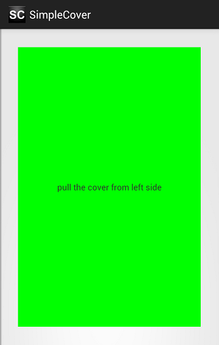

SideCover
======================

Features　
--
SideCoverはコンテンツの上側に表示されるカバーのようなウィジェットです。

* CoverはLeftSideかRightSideを指定します。
* スワイプ操作でCoverを開け閉めすることもできます。  
* StyleでいくつかのCoverの属性を指定できます。  
  * background,coverWidth,shadowWidh,shadowColor,透過アニメーションの有無

Usage　
--
library:ライブラリプロジェクト  
sample:サンプルプロジェクト  
サンプル見てください

License
--
    Copyright &copy; 2013 Takahiro GOTO
    Licensed under the [Apache License, Version 2.0][Apache]
    You may not use this file except in compliance with the License.
    You may obtain a copy of the License at
 
    http://www.apache.org/licenses/LICENSE-2.0

    Unless required by applicable law or agreed to in writing, software
    distributed under the License is distributed on an "AS IS" BASIS,
    WITHOUT WARRANTIES OR CONDITIONS OF ANY KIND, either express or implied.
    See the License for the specific language governing permissions and 
    limitations under the License.
